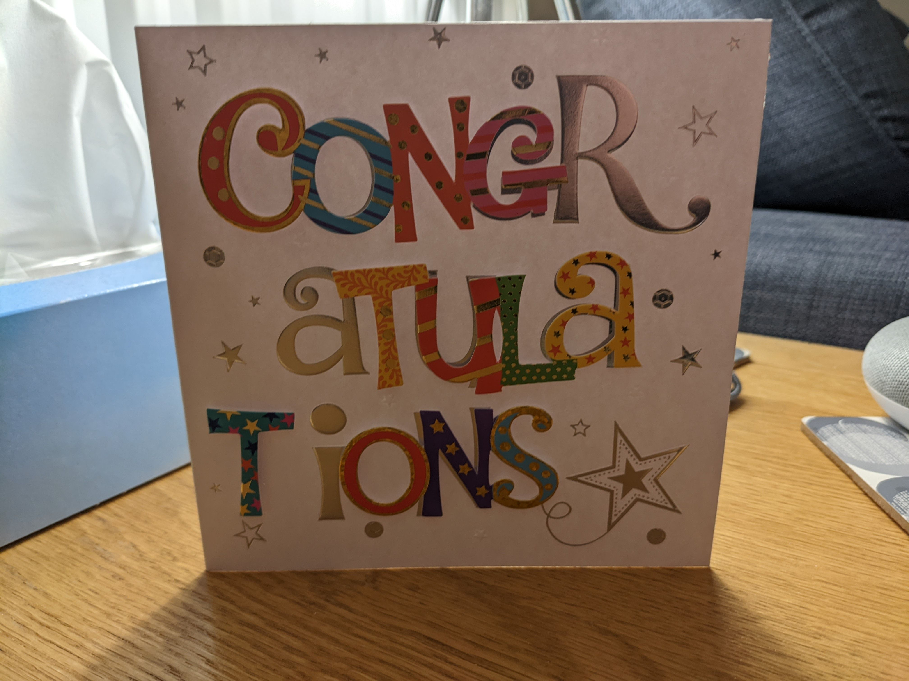

This week has been weird.

So - I got promoted to be a Senior Associate in Software Engineering this week.

Yet, since I got told the news and writing this now: I do not feel elation or great joy from finding this out. I just feel numb and empty about this and in the passing days since at points, down. Although relieved also to an extent.

(Slight aside: his week was collectively known as "letter day" at work: When every single person in the company finds out if the last year was a good year - or one to forgot. Its also when people find out if they are getting promoted or not. I have joking called it "the adult exam result day". I have said I am personally not a fan of this system).

I feel for me the issue lies in I don't want people to know I got a promotion - or **what I really mean is** I want people to forget about/don't realise that I got it only this year. If you look at my peers (including people that started *the exact same day* as me) then I feel for my career trajectory I am trailing behind. If you are wondering at the moment "That doesn't matter and you are barking up the wrong tree" then may I suggest you join the queue and continue reading.

I unfortunately have to deal with having [Social anxiety](https://en.wikipedia.org/wiki/Social_anxiety_disorder). Its an open secret at this point, but I don't try to advertise that my mental health has not always been fantastic, and will have dips. Still, dealing with what happened this week - I feel like I do not want to draw attention to this **as I think (and this is in my head, unrelated to what people actually think)** people will then ask "Wait, it took him how long?, etc" and end up thinking less of me. Ladies and gentlemen - that back of a envelope definition of Social Anxiety is "Individuals ... fear negative evaluations from other people".

I tried to explain this to people this week as "the rational logical part of my head accepts this, but the emotional side is flat out just saying 'Nope, your lying, I don't believe you'" and is trying to protect me. Its a very week metaphor but I was / still am clutching at straws here.

So much so that the only people I have directly told are my parents - and that's because they asked and I buried the news behind everything else that happened that day. (Yes, I actually covered going for a walk at lunch and the weather before telling them. Predictably, there were very happy for me but would of preferred the ordering to be different.) I did a nice card though:

Now - let me be clear: I worked for this promotion and I believe I deserve it. I am taking the deal. It is something I have wanted to get for a while (as my line manager would a-test to), yet I don't really want to talk about it or have a hard time acknowledging people congratulating me on this achievement.

Case in point, I can count on 1 hand the people I have told before this goes up online (this is not trying to keep people out the loop, I just feel like I don't know how to react correctly to them without seeming ungrateful - so please don't take offence if I say / said "Thanks" and call it a day).

Also, I don't like to show off usually. Except when I bake or put up Christmas lights.

So - if I have been quiet or not myself this week, this is why. I'll be back to normal soon.